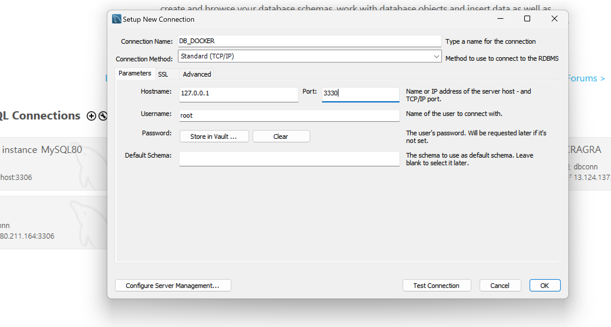

# DOCKER 

|-|
|-|
|[DOCKER 란](https://khj93.tistory.com/entry/Docker-Docker-%EA%B0%9C%EB%85%90)|
|[DOCKER 란](https://adjh54.tistory.com/352)|


---
DB/REDIS DOCKER IMAGE 생성
---

> DB - Dockerfile
```
# MySQL 8.0 공식 이미지를 기반으로 설정
FROM mysql:8.0

# 환경 변수 설정
ENV MYSQL_ROOT_PASSWORD=Zhfldk11!
ENV MYSQL_DATABASE=bookdb
ENV MYSQL_USER=dbonn
ENV MYSQL_PASSWORD=Zhfldk11!

# 3306 포트 노출
EXPOSE 3306 

# MySQL 서버 실행
CMD ["mysqld"]

```
> DB - Docker Image 생성
```
C:\Users\jwg13\Downloads\TEST___\09_DEPLOYMENT\DOCUMENT\04_\DB> docker build -t db .

[+] Building 2.1s (6/6) FINISHED                                                                         docker:desktop-linux
 => [internal] load build definition from Dockerfile                                                                     0.0s
 => => transferring dockerfile: 329B                                                                                     0.0s
 => [internal] load metadata for docker.io/library/mysql:8.0                                                             1.8s
 => [auth] library/mysql:pull token for registry-1.docker.io                                                             0.0s
 => [internal] load .dockerignore                                                                                        0.0s
 => => transferring context: 2B                                                                                          0.0s
 => CACHED [1/1] FROM docker.io/library/mysql:8.0@sha256:d58ac93387f644e4e040c636b8f50494e78e5afc27ca0a87348b2f577da2b7  0.0s
 => => resolve docker.io/library/mysql:8.0@sha256:d58ac93387f644e4e040c636b8f50494e78e5afc27ca0a87348b2f577da2b7ff       0.0s
 => exporting to image                                                                                                   0.1s
 => => exporting layers                                                                                                  0.0s
 => => exporting manifest sha256:4eb8d45972b4b5857468f53a241b082fadd1d0a9d532dcb24154d64b1320d155                        0.0s
 => => exporting config sha256:1132e9319288213d9ae6a8366be335db1866a42e0ed646af58d95dae352bfa02                          0.0s
 => => exporting attestation manifest sha256:8003dc77b038ecc14a39da01b4aae9417e147bfa954c13920afb5145cf496229            0.0s
 => => exporting manifest list sha256:8183cb6d5f3706683990212c79a74f53f05369af2f064e96dcbfc66eda08cdd6                   0.0s
 => => naming to docker.io/library/db:latest                                                                             0.0s
 => => unpacking to docker.io/library/db:latest                                                                          0.0s

 2 warnings found (use docker --debug to expand):
 - SecretsUsedInArgOrEnv: Do not use ARG or ENV instructions for sensitive data (ENV "MYSQL_ROOT_PASSWORD") (line 5)
 - SecretsUsedInArgOrEnv: Do not use ARG or ENV instructions for sensitive data (ENV "MYSQL_PASSWORD") (line 8)

C:\Users\jwg13\Downloads\TEST___\09_DEPLOYMENT\DOCUMENT\04_\DB>docker images
REPOSITORY   TAG       IMAGE ID       CREATED        SIZE
db           latest    8183cb6d5f37   2 months ago   811MB
```


> REDIS - Dockerfile
```
# Redis 이미지 기반
FROM redis:latest

# 기본 작업 디렉토리 설정 (선택 사항)
WORKDIR /usr/local/etc/redis

# 사용자 정의 Redis 설정 파일 복사 (필요한 경우)
# COPY redis.conf ./redis.conf

# 포트 노출
EXPOSE 6379

# Redis 시작 명령 (사용자 정의 설정 파일이 있는 경우 주석 해제)
# CMD ["redis-server", "/usr/local/etc/redis/redis.conf"]
CMD ["redis-server"]

```

> REDIS - Docker Image 생성
```
C:\Users\jwg13\Downloads\TEST___\09_DEPLOYMENT\DOCUMENT\04_\REDIS>docker build -t redis .
[+] Building 1.9s (7/7) FINISHED                                                                         docker:desktop-linux
 => [internal] load build definition from Dockerfile                                                                     0.0s
 => => transferring dockerfile: 471B                                                                                     0.0s
 => [internal] load metadata for docker.io/library/redis:latest                                                          1.7s
 => [auth] library/redis:pull token for registry-1.docker.io                                                             0.0s
 => [internal] load .dockerignore                                                                                        0.0s
 => => transferring context: 2B                                                                                          0.0s
 => [1/2] FROM docker.io/library/redis:latest@sha256:cd13b924409d740ea8abe6677a7d1accf696898408d330a3d7c8234fa7545775    0.0s
 => => resolve docker.io/library/redis:latest@sha256:cd13b924409d740ea8abe6677a7d1accf696898408d330a3d7c8234fa7545775    0.0s
 => CACHED [2/2] WORKDIR /usr/local/etc/redis                                                                            0.0s
 => exporting to image                                                                                                   0.1s
 => => exporting layers                                                                                                  0.0s
 => => exporting manifest sha256:79f78ad6cbdd964969f513f202653f617bfc3f7143e2a2530c22688c2d3f4512                        0.0s
 => => exporting config sha256:9d3b76343575cdee8c3bdce17caf080c9272b5d112b1c1df30d97f8847d76c02                          0.0s
 => => exporting attestation manifest sha256:d894b65dda824c7f8710266ebf94434e20b37efc294c66ec1e76d56d8e8c3b4a            0.0s
 => => exporting manifest list sha256:4b7f9efa7422bc4a6d8c2a082a3e6fd47b37ae0538d2da39c53878356a3d8082                   0.0s
 => => naming to docker.io/library/redis:latest                                                                          0.0s
 => => unpacking to docker.io/library/redis:latest                                                                       0.0s

C:\Users\jwg13\Downloads\TEST___\09_DEPLOYMENT\DOCUMENT\04_\REDIS>docker images
REPOSITORY   TAG       IMAGE ID       CREATED        SIZE
redis        latest    4b7f9efa7422   8 hours ago    173MB
db           latest    8183cb6d5f37   2 months ago   811MB
```


---
DB/REDIS CONTAINER 생성/접속
---

>CUSTOM NETWORK 생성
```
C:\Users\jwg13\Downloads\TEST___\09_DEPLOYMENT\DOCUMENT\04_\REDIS>docker network create --subnet=192.168.1.0/24 my-custom-network
3db963b86664cc514c2410c2576192c73d3d402305618eb885acd9edcc9d5bed

C:\Users\jwg13\Downloads\TEST___\09_DEPLOYMENT\DOCUMENT\04_\REDIS>docker network ls
NETWORK ID     NAME                DRIVER    SCOPE
9fa0e25912b3   bridge              bridge    local
942157df98eb   host                host      local
3db963b86664   my-custom-network   bridge    local
7e7b25210dc0   none                null      local

```

>DB CONTAINER 생성
```
C:\Users\jwg13\Downloads\TEST___\09_DEPLOYMENT\DOCUMENT\04_\REDIS>docker run -d --network my-custom-network --ip 192.168.1.100 --name db-container -p 3330:3306 db:latest
52d53d30376aaf6468593d21b201d7ee6efafc870d593a4bcdb168bf4b94cfc8

C:\Users\jwg13\Downloads\TEST___\09_DEPLOYMENT\DOCUMENT\04_\REDIS>docker ps
CONTAINER ID   IMAGE       COMMAND                   CREATED         STATUS         PORTS                               NAMES
52d53d30376a   db:latest   "docker-entrypoint.s…"   6 seconds ago   Up 6 seconds   33060/tcp, 0.0.0.0:3330->3306/tcp   db-container

```
> 확인
|-|
|-|
||
||
||
||

REDIS
```

```

---
-
---


> BN
```

```

> FN
```

```


---
TMP
---
---
EC2 DOCKER 사용해보기(- 수정중 - )
---

> DOCKER 설치
```
[root@ip-10-0-0-8 libs]# yum install docker -y
[root@ip-10-0-0-8 libs]# docker -v
[root@ip-10-0-0-8 libs]# systemctl restart docker
[root@ip-10-0-0-8 libs]# systemctl status docker

```

DOCKER IMAGE CONTAINER 받기
---

> IMAGE PULL <br>

```
[root@ip-10-0-0-8 libs]# docker search centos:8
[root@ip-10-0-0-8 libs]# docker pull centos:8
7: Pulling from library/centos
2d473b07cdd5: Pull complete
Digest: sha256:be65f488b7764ad3638f236b7b515b3678369a5124c47b8d32916d6487418ea4
Status: Downloaded newer image for centos:7
docker.io/library/centos:7

[root@ip-10-0-0-8 libs]# docker images
REPOSITORY   TAG       IMAGE ID       CREATED       SIZE
centos       8         eeb6ee3f44bd   2 years ago   204MB

```

> DOCKER CONTAINER 생성 <br>

```
[root@ip-10-0-0-8 libs]# docker run --privileged --name centos-test --hostname centos-test --network host  -p 80:80 -it -d centos:8 /sbin/init
WARNING: Published ports are discarded when using host network mode
135e94f67eddee71b1a2db522c31ce3655ae222b9cb3ec69ee3b1b52f70a711f

[root@ip-10-0-0-8 libs]# docker ps
CONTAINER ID   IMAGE      COMMAND        CREATED         STATUS         PORTS     NAMES
135e94f67edd   centos:8   "/sbin/init"   2 minutes ago   Up 2 minutes             centos-test


```

> 방화벽 설정 <br>

|-|
|-|
||


> DOCKER CONTAINER 실행<br>

```
[root@ip-10-0-0-8 libs]# docker exec -it centos-test /bin/bash
[root@centos-test /]#

```

> 패키지 설치<br>

```
[root@centos-test /]# yum install -y httpd
```

> index page만들기 <br>

```
[root@centos-test /]# cd /var/www/html
[root@centos-test html]# cat > index.html
DOCKER_TEST_PAGE
^C

```
> 서비스실행<br>

```
systemctl restart httpd
systemctl enable httpd

```

