# DOCKER 

|-|
|-|
|[DOCKER 란](https://khj93.tistory.com/entry/Docker-Docker-%EA%B0%9C%EB%85%90)|
|[DOCKER 란](https://adjh54.tistory.com/352)|


---
DB/REDIS DOCKER IMAGE 생성
---

> DB - Dockerfile
```
# MySQL 8.0 공식 이미지를 기반으로 설정
FROM mysql:8.0

# 환경 변수 설정
ENV MYSQL_ROOT_PASSWORD=Zhfldk11!
ENV MYSQL_DATABASE=bookdb
ENV MYSQL_USER=dbonn
ENV MYSQL_PASSWORD=Zhfldk11!

# 3306 포트 노출
EXPOSE 3306 

# MySQL 서버 실행
CMD ["mysqld"]

```
> DB - Docker Image 생성
```
C:\Users\jwg13\Downloads\TEST___\09_DEPLOYMENT\DOCUMENT\04_\DB> docker build -t db .

[+] Building 2.1s (6/6) FINISHED                                                                         docker:desktop-linux
 => [internal] load build definition from Dockerfile                                                                     0.0s
 => => transferring dockerfile: 329B                                                                                     0.0s
 => [internal] load metadata for docker.io/library/mysql:8.0                                                             1.8s
 => [auth] library/mysql:pull token for registry-1.docker.io                                                             0.0s
 => [internal] load .dockerignore                                                                                        0.0s
 => => transferring context: 2B                                                                                          0.0s
 => CACHED [1/1] FROM docker.io/library/mysql:8.0@sha256:d58ac93387f644e4e040c636b8f50494e78e5afc27ca0a87348b2f577da2b7  0.0s
 => => resolve docker.io/library/mysql:8.0@sha256:d58ac93387f644e4e040c636b8f50494e78e5afc27ca0a87348b2f577da2b7ff       0.0s
 => exporting to image                                                                                                   0.1s
 => => exporting layers                                                                                                  0.0s
 => => exporting manifest sha256:4eb8d45972b4b5857468f53a241b082fadd1d0a9d532dcb24154d64b1320d155                        0.0s
 => => exporting config sha256:1132e9319288213d9ae6a8366be335db1866a42e0ed646af58d95dae352bfa02                          0.0s
 => => exporting attestation manifest sha256:8003dc77b038ecc14a39da01b4aae9417e147bfa954c13920afb5145cf496229            0.0s
 => => exporting manifest list sha256:8183cb6d5f3706683990212c79a74f53f05369af2f064e96dcbfc66eda08cdd6                   0.0s
 => => naming to docker.io/library/db:latest                                                                             0.0s
 => => unpacking to docker.io/library/db:latest                                                                          0.0s

 2 warnings found (use docker --debug to expand):
 - SecretsUsedInArgOrEnv: Do not use ARG or ENV instructions for sensitive data (ENV "MYSQL_ROOT_PASSWORD") (line 5)
 - SecretsUsedInArgOrEnv: Do not use ARG or ENV instructions for sensitive data (ENV "MYSQL_PASSWORD") (line 8)

C:\Users\jwg13\Downloads\TEST___\09_DEPLOYMENT\DOCUMENT\04_\DB>docker images
REPOSITORY   TAG       IMAGE ID       CREATED        SIZE
db           latest    8183cb6d5f37   2 months ago   811MB
```


> REDIS - Dockerfile
```
# Redis 이미지 기반
FROM redis:latest

# 기본 작업 디렉토리 설정 (선택 사항)
WORKDIR /usr/local/etc/redis

# 사용자 정의 Redis 설정 파일 복사 (필요한 경우)
# COPY redis.conf ./redis.conf

# 포트 노출
EXPOSE 6379

# Redis 시작 명령 (사용자 정의 설정 파일이 있는 경우 주석 해제)
# CMD ["redis-server", "/usr/local/etc/redis/redis.conf"]
CMD ["redis-server"]

```

> REDIS - Docker Image 생성
```
C:\Users\jwg13\Downloads\TEST___\09_DEPLOYMENT\DOCUMENT\04_\REDIS>docker build -t redis .
[+] Building 1.9s (7/7) FINISHED                                                                         docker:desktop-linux
 => [internal] load build definition from Dockerfile                                                                     0.0s
 => => transferring dockerfile: 471B                                                                                     0.0s
 => [internal] load metadata for docker.io/library/redis:latest                                                          1.7s
 => [auth] library/redis:pull token for registry-1.docker.io                                                             0.0s
 => [internal] load .dockerignore                                                                                        0.0s
 => => transferring context: 2B                                                                                          0.0s
 => [1/2] FROM docker.io/library/redis:latest@sha256:cd13b924409d740ea8abe6677a7d1accf696898408d330a3d7c8234fa7545775    0.0s
 => => resolve docker.io/library/redis:latest@sha256:cd13b924409d740ea8abe6677a7d1accf696898408d330a3d7c8234fa7545775    0.0s
 => CACHED [2/2] WORKDIR /usr/local/etc/redis                                                                            0.0s
 => exporting to image                                                                                                   0.1s
 => => exporting layers                                                                                                  0.0s
 => => exporting manifest sha256:79f78ad6cbdd964969f513f202653f617bfc3f7143e2a2530c22688c2d3f4512                        0.0s
 => => exporting config sha256:9d3b76343575cdee8c3bdce17caf080c9272b5d112b1c1df30d97f8847d76c02                          0.0s
 => => exporting attestation manifest sha256:d894b65dda824c7f8710266ebf94434e20b37efc294c66ec1e76d56d8e8c3b4a            0.0s
 => => exporting manifest list sha256:4b7f9efa7422bc4a6d8c2a082a3e6fd47b37ae0538d2da39c53878356a3d8082                   0.0s
 => => naming to docker.io/library/redis:latest                                                                          0.0s
 => => unpacking to docker.io/library/redis:latest                                                                       0.0s

C:\Users\jwg13\Downloads\TEST___\09_DEPLOYMENT\DOCUMENT\04_\REDIS>docker images
REPOSITORY   TAG       IMAGE ID       CREATED        SIZE
redis        latest    4b7f9efa7422   8 hours ago    173MB
db           latest    8183cb6d5f37   2 months ago   811MB
```


---
CUSTOM NETWORK 생성
---
```
C:\Users\jwg13\Downloads\TEST___\09_DEPLOYMENT\DOCUMENT\04_\REDIS>docker network create --subnet=192.168.1.0/24 my-custom-network
3db963b86664cc514c2410c2576192c73d3d402305618eb885acd9edcc9d5bed

C:\Users\jwg13\Downloads\TEST___\09_DEPLOYMENT\DOCUMENT\04_\REDIS>docker network ls
NETWORK ID     NAME                DRIVER    SCOPE
9fa0e25912b3   bridge              bridge    local
942157df98eb   host                host      local
3db963b86664   my-custom-network   bridge    local
7e7b25210dc0   none                null      local

```

---
DB CONTAINER 생성/접속
---

>DB CONTAINER 생성
```
C:\Users\jwg13\Downloads\TEST___\09_DEPLOYMENT\DOCUMENT\04_\REDIS>docker run -d --network my-custom-network --ip 192.168.1.100 --name db-container -p 3330:3306 db:latest
52d53d30376aaf6468593d21b201d7ee6efafc870d593a4bcdb168bf4b94cfc8

C:\Users\jwg13\Downloads\TEST___\09_DEPLOYMENT\DOCUMENT\04_\REDIS>docker ps
CONTAINER ID   IMAGE       COMMAND                   CREATED         STATUS         PORTS                               NAMES
52d53d30376a   db:latest   "docker-entrypoint.s…"   6 seconds ago   Up 6 seconds   33060/tcp, 0.0.0.0:3330->3306/tcp   db-container

```
> 확인

|-|
|-|
||
||
||
||


---
REDIS CONTAINER 생성/접속
---
>REDIS CONTAINER 생성
```
C:\Users\jwg13\Downloads\TEST___\09_DEPLOYMENT\DOCUMENT\04_\REDIS>docker run -d --network my-custom-network --ip 192.168.1.200 --name redis-container -p 6379:6379 redis:latest
7ef389c4cf4b44656a87d1e14dbfb99bf2c1aeeaabf86992c23ecd472a705756

C:\Users\jwg13\Downloads\TEST___\09_DEPLOYMENT\DOCUMENT\04_\REDIS>docker ps
CONTAINER ID   IMAGE          COMMAND                   CREATED         STATUS         PORTS                               NAMES
7ef389c4cf4b   redis:latest   "docker-entrypoint.s…"   2 seconds ago   Up 1 second    0.0.0.0:6379->6379/tcp              redis-container
52d53d30376a   db:latest      "docker-entrypoint.s…"   8 minutes ago   Up 8 minutes   33060/tcp, 0.0.0.0:3330->3306/tcp   db-container
```

> 확인

|-|
|-|
|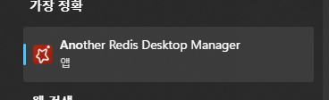|
|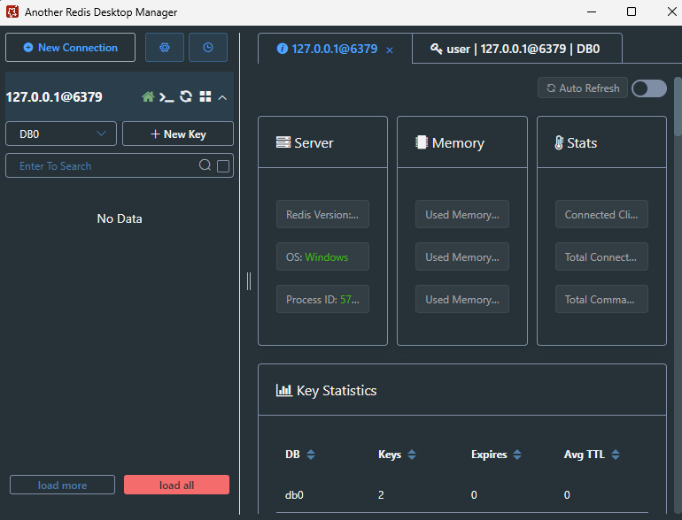|

---
BN CODE 수정
---

|-|
|-|
|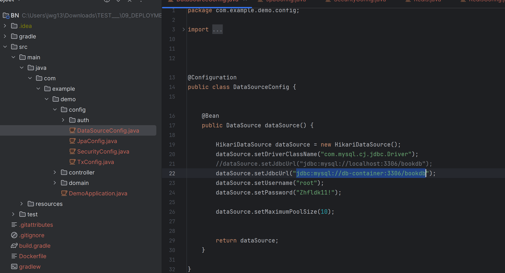|
|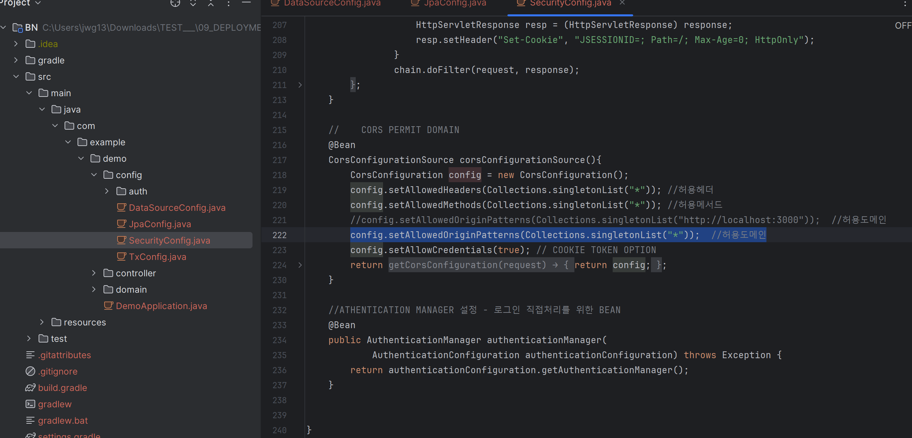|
|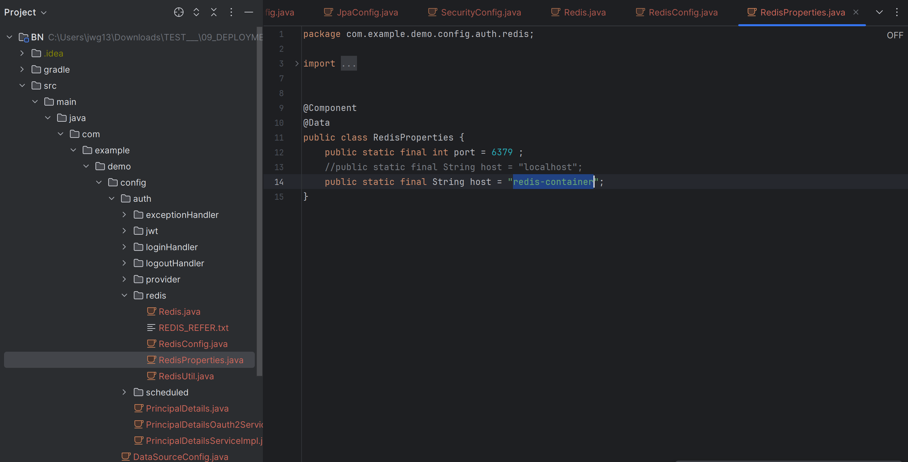|


---
BN Image 생성
---

> BN Dockerfile
```
# 빌드 스테이지
FROM gradle:8.11.1-jdk21 AS build
WORKDIR /app
COPY . .
RUN gradle build --no-daemon -x test

# 실행 스테이지
FROM eclipse-temurin:21-jdk

# 기본 작업 디렉토리 설정
WORKDIR /app

# 빌드 스테이지에서 생성된 JAR 파일을 복사
COPY --from=build /app/build/libs/*.jar app.jar

# 환경 변수 설정
ENV TZ=Asia/Seoul
RUN apt-get update && apt-get install -y \
    mysql-client \
    iputils-ping \
    net-tools \
    && apt-get clean

# 포트 설정
EXPOSE 8095

# 실행 명령
CMD ["java", "-jar", "app.jar"] 

```

> BN Dockerfile
```
# 빌드 스테이지
FROM gradle:8.11.1-jdk21 AS build
WORKDIR /app
COPY . .
RUN gradle build --no-daemon -x test

# 실행 스테이지
FROM eclipse-temurin:21-jdk

# 기본 작업 디렉토리 설정
WORKDIR /app

# 빌드 스테이지에서 생성된 JAR 파일을 복사
COPY --from=build /app/build/libs/*.jar app.jar

# 환경 변수 설정
ENV TZ=Asia/Seoul
RUN apt-get update && apt-get install -y \
    mysql-client \
    iputils-ping \
    net-tools \
    && apt-get clean

# 포트 설정
EXPOSE 8095

# 실행 명령
CMD ["java", "-jar", "app.jar"] 

```

>BN - Image 생성
```
C:\Users\jwg13\Downloads\TEST___\09_DEPLOYMENT\DOCUMENT\04_\BN>docker build -t bn .
[+] Building 47.6s (16/16) FINISHED                                                                                                    docker:desktop-linux
 => [internal] load build definition from Dockerfile                                                                                                   0.0s
 => => transferring dockerfile: 630B                                                                                                                   0.0s
 => [internal] load metadata for docker.io/library/gradle:8.11.1-jdk21                                                                                 1.8s
 => [internal] load metadata for docker.io/library/eclipse-temurin:21-jdk                                                                              1.8s
 => [auth] library/gradle:pull token for registry-1.docker.io                                                                                          0.0s
 => [auth] library/eclipse-temurin:pull token for registry-1.docker.io                                                                                 0.0s
 => [internal] load .dockerignore                                                                                                                      0.0s
 => => transferring context: 2B                                                                                                                        0.0s
 => [internal] load build context                                                                                                                      0.0s
 => => transferring context: 167.85kB                                                                                                                  0.0s
 => [build 1/4] FROM docker.io/library/gradle:8.11.1-jdk21@sha256:7990a44ed0ad609ee740426d3becc69ae7d10a5ed14da7e354ad83cf7ef1d087                     0.0s
 => => resolve docker.io/library/gradle:8.11.1-jdk21@sha256:7990a44ed0ad609ee740426d3becc69ae7d10a5ed14da7e354ad83cf7ef1d087                           0.0s
 => [stage-1 1/4] FROM docker.io/library/eclipse-temurin:21-jdk@sha256:843686b2422d68890bb3ee90c5d08d9b325b9a2acf06ffca42351c2d187d3921                0.0s
 => => resolve docker.io/library/eclipse-temurin:21-jdk@sha256:843686b2422d68890bb3ee90c5d08d9b325b9a2acf06ffca42351c2d187d3921                        0.0s
 => CACHED [build 2/4] WORKDIR /app                                                                                                                    0.0s
 => [build 3/4] COPY . .                                                                                                                               0.0s
 => [build 4/4] RUN gradle build --no-daemon -x test                                                                                                  30.7s
 => CACHED [stage-1 2/4] WORKDIR /app                                                                                                                  0.0s
 => [stage-1 3/4] COPY --from=build /app/build/libs/*.jar app.jar                                                                                      0.1s
 => [stage-1 4/4] RUN apt-get update && apt-get install -y     mysql-client     iputils-ping     net-tools     && apt-get clean                       10.1s
 => exporting to image                                                                                                                                 3.9s
 => => exporting layers                                                                                                                                3.1s
 => => exporting manifest sha256:6a9f47b9da522b6e005bf0e520cfa875821b95026572c8a70810739d9402b811                                                      0.0s
 => => exporting config sha256:65c9b2f5c79e186372bc8c812d1de365e820717b81ebd2294ddef4ed9cddffab                                                        0.0s
 => => exporting attestation manifest sha256:1f53f67b6a78a7d031dc7a4fbd30ce47131e9333aaec4e81e3fdea1dc24b3245                                          0.0s
 => => exporting manifest list sha256:43213f028948e4128083dfd8638559b64839c71579d17efc8aeb205d43670a2b                                                 0.0s
 => => naming to docker.io/library/bn:latest                                                                                                           0.0s
 => => unpacking to docker.io/library/bn:latest                                                                                                        0.8s

C:\Users\jwg13\Downloads\TEST___\09_DEPLOYMENT\DOCUMENT\04_\BN>docker images
REPOSITORY   TAG       IMAGE ID       CREATED         SIZE
bn           latest    43213f028948   7 seconds ago   967MB
redis        latest    4b7f9efa7422   8 hours ago     173MB
db           latest    8183cb6d5f37   2 months ago    811MB
```


>BN - Container 생성
```
C:\Users\jwg13>docker run -d --network my-custom-network --ip 192.168.1.20 --name bn-container -p 8095:8095 bn:latest
c2fa4643bef4a3c374283788c391fd7a7b49ac8317b6e2490e17aad391ea67b7

C:\Users\jwg13>docker ps
CONTAINER ID   IMAGE          COMMAND                   CREATED          STATUS          PORTS                               NAMES
c2fa4643bef4   bn:latest      "/__cacert_entrypoin…"   7 seconds ago    Up 6 seconds    0.0.0.0:8095->8095/tcp              bn-container
7ef389c4cf4b   redis:latest   "docker-entrypoint.s…"   41 minutes ago   Up 41 minutes   0.0.0.0:6379->6379/tcp              redis-container
52d53d30376a   db:latest      "docker-entrypoint.s…"   49 minutes ago   Up 49 minutes   33060/tcp, 0.0.0.0:3330->3306/tcp   db-container
```

>확인


|-|
|-|
|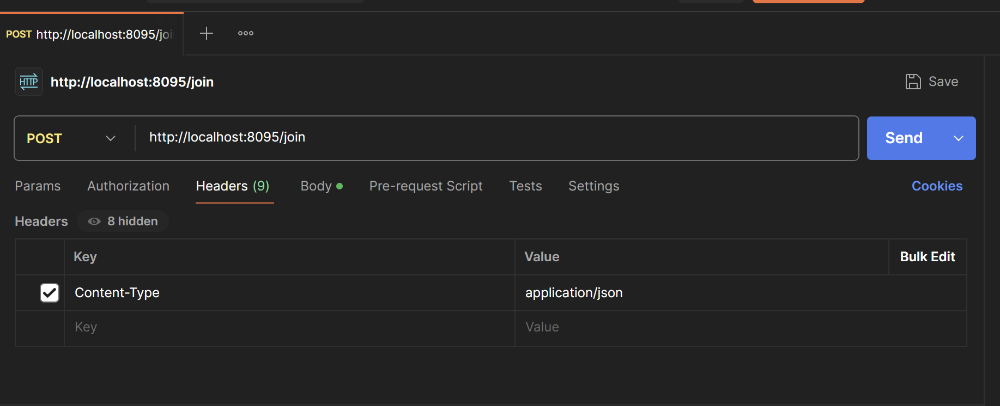|
|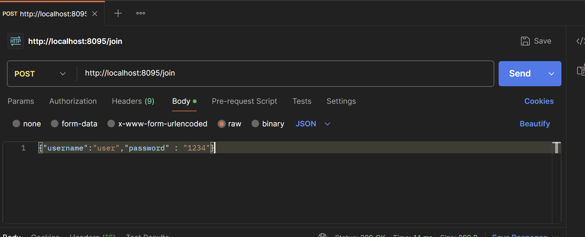|
|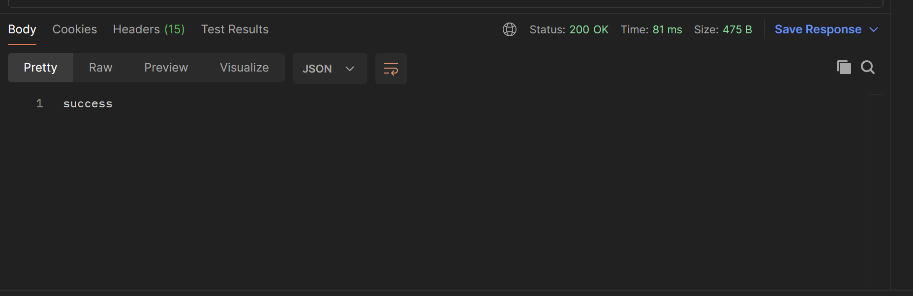|
|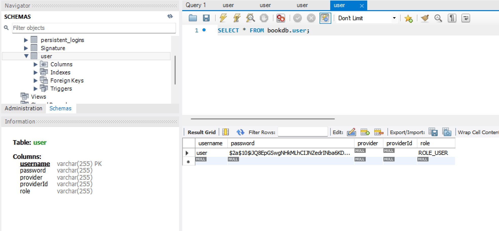|
|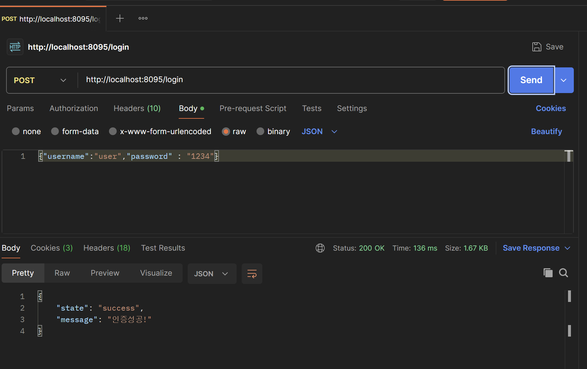|
|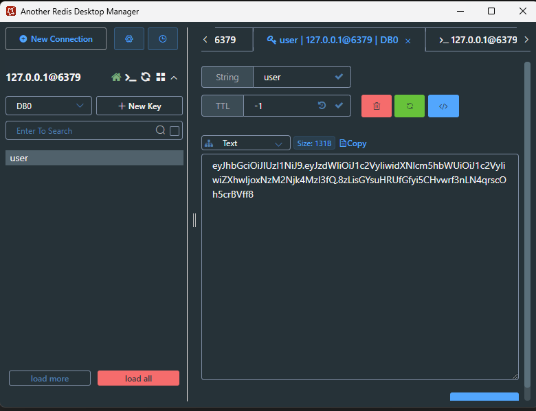|
|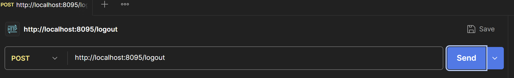|
|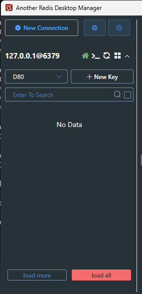|


> FN
```

```


---
TMP
---
---
EC2 DOCKER 사용해보기(- 수정중 - )
---

> DOCKER 설치
```
[root@ip-10-0-0-8 libs]# yum install docker -y
[root@ip-10-0-0-8 libs]# docker -v
[root@ip-10-0-0-8 libs]# systemctl restart docker
[root@ip-10-0-0-8 libs]# systemctl status docker

```

DOCKER IMAGE CONTAINER 받기
---

> IMAGE PULL <br>

```
[root@ip-10-0-0-8 libs]# docker search centos:8
[root@ip-10-0-0-8 libs]# docker pull centos:8
7: Pulling from library/centos
2d473b07cdd5: Pull complete
Digest: sha256:be65f488b7764ad3638f236b7b515b3678369a5124c47b8d32916d6487418ea4
Status: Downloaded newer image for centos:7
docker.io/library/centos:7

[root@ip-10-0-0-8 libs]# docker images
REPOSITORY   TAG       IMAGE ID       CREATED       SIZE
centos       8         eeb6ee3f44bd   2 years ago   204MB

```

> DOCKER CONTAINER 생성 <br>

```
[root@ip-10-0-0-8 libs]# docker run --privileged --name centos-test --hostname centos-test --network host  -p 80:80 -it -d centos:8 /sbin/init
WARNING: Published ports are discarded when using host network mode
135e94f67eddee71b1a2db522c31ce3655ae222b9cb3ec69ee3b1b52f70a711f

[root@ip-10-0-0-8 libs]# docker ps
CONTAINER ID   IMAGE      COMMAND        CREATED         STATUS         PORTS     NAMES
135e94f67edd   centos:8   "/sbin/init"   2 minutes ago   Up 2 minutes             centos-test


```

> 방화벽 설정 <br>

|-|
|-|
||


> DOCKER CONTAINER 실행<br>

```
[root@ip-10-0-0-8 libs]# docker exec -it centos-test /bin/bash
[root@centos-test /]#

```

> 패키지 설치<br>

```
[root@centos-test /]# yum install -y httpd
```

> index page만들기 <br>

```
[root@centos-test /]# cd /var/www/html
[root@centos-test html]# cat > index.html
DOCKER_TEST_PAGE
^C

```
> 서비스실행<br>

```
systemctl restart httpd
systemctl enable httpd

```

